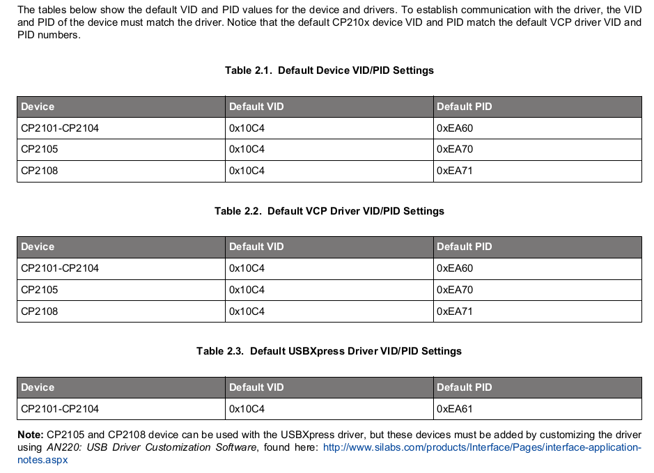

================
 cp210x-program
================

|ci| |wheels| |release| |badge|

|tag| |license| |python| |pylint|

The goal of this library is to provide access to the EEPROM of an Silabs CP210x
under Linux.

.. warning:: THE LEGACY VERSION OF cp210x-program IS NOT FULLY TESTED. IT MAY RENDER
             YOUR CP210x USELESS OR DESTROY IT.  Be aware that the current
             (legacy) version was only tested on CP2102.

The CP210x is a series of USB-to-serial chip used in a lot of USB devices
(similar to FTDIs and PL2303). Certain CP210x devices have an EEPROM on
the chip which can be programmed via USB, while others only have the OTP
EPROM (which cannot be reprogrammed; see `Model notes`_). Silabs provides
various source code examples for Windows and Linux, and multiple drivers
for Windows.

This project uses results from monitoring the USB bus when the windows library
programs the CP210x device. The windows library was not disassembled for this
protocol analysis.

When the program is finished, a later goal would be to provide a library which
can be used to access further functions of the CP210x like the general IO pins
of the CP2103. The goal is not to provide an tty driver, such drivers exist
already for linux and BSD.

Dependencies
------------

* Python >= 3
* PyUSB

Since libusb is available on most Linux, Mac OS X and FreeBSD cp210x-program
should run flawlessly on these platforms. Currently it is only tested on
Linux 2.6 (Ubuntu).

If cp210x-program should run as non-root user, add the udev rule found in
doc/45-cp210x-programming.rules to /etc/udev/rules.d. When devices with already
programmed IDs are reprogrammed at this IDs to 45-cp210x-programming.rules.

Install deps on Ubuntu::

  $ sudo apt install python3-usb

Usage
-----

Read EEPROM content into hexfile::

  $ cp210x-program --read-cp210x -f eeprom-content.hex

Show EEPROM content from device 002 on bus 001::

  $ cp210x-program --read-cp210x -m 001/002

Write some data to device with vendor id 0x10C4 and product id 0xEA62::

  $ cp210x-program --write-cp210x -m 10C4:EA62 \
                 --set-product-string="Product String" \
                 --set-max-power=100 \
                 --set-bus-powered=no

Write default data to device::

  $ cp210x-program --write-cp210x -F testdata/cp2102-orig.hex

This is for example required when the baud rate table is corrupted and
the CP210x always uses 500kBit/sec as baudrate.

TODO
----

* (re)Test on CP2102 and CP2103 (legacy parts)
* read config blob from CP2102N (new part)

Model notes
-----------

Taken from the respective device Data Sheets:

* CP2101 - EEPROM (512 byte)  *may work*
* CP2102 - EEPROM (1024 byte)  *should work*
* CP2103 - EEPROM (1024 byte)  *should work*
* CP2104 - EPROM only (1024 byte, not re-programmable)
* CP2105 - EPROM only (296 byte, not re-programmable)
* CP2109 - EPROM only (1024 byte, not re-programmable)
* CP2102N - EEPROM (960 byte) **will not work** with legacy ``cp210x-program``

The following table from AN721 shows the default SiLabs USB device IDs; note
third-party manufacturers often do not reprogram with their own vendor/product
IDs.

Links
-----

* Original cp210x-program / CP210x Programmer project page by Petr Tesarik (a.k.a. tesarik)
  and Johannes Hölzl (a.k.a. johoelzl): https://sourceforge.net/projects/cp210x-program/

* CP2102N Product page and Data Sheet on Silicon Labs:

  + https://www.silabs.com/interface/usb-bridges/usbxpress/device.cp2102n-gqfn20
  + https://www.silabs.com/documents/public/data-sheets/cp2102n-datasheet.pdf

* AN978 CP210x USB-to-UART API Specification:

  + note this mainly documents HW/package and feature compatibility, amd only discusses
    the (newer) CP2102N model as far as configuration byte layout
  + https://www.silabs.com/documents/public/application-notes/an978-cp210x-usb-to-uart-api-specification.pdf

* AN721 Device Customization Guide:

  + https://www.silabs.com/documents/public/application-notes/AN721.pdf
  + https://www.silabs.com/documents/public/example-code/AN721SW.zip

* AN197 CP210x Serial Communications Guide:

  + https://www.silabs.com/documents/public/application-notes/an197.pdf
  + https://www.silabs.com/documents/public/example-code/AN197SW.zip

* AN223 Port Configuration and GPIO for CP210x

  + https://www.silabs.com/documents/public/application-notes/an223.pdf
  + https://www.silabs.com/documents/public/example-code/AN223SW.zip

License
-------

The python package 'cp210x' and the python script 'cp210x-program' are provided
under the terms of the GNU LGPL. See LICENSE.

.. |ci| image:: https://github.com/VCTLabs/cp210x-program/actions/workflows/ci.yml/badge.svg
    :target: https://github.com/VCTLabs/cp210x-program/actions/workflows/ci.yml
    :alt: CI Status

.. |wheels| image:: https://github.com/VCTLabs/cp210x-program/actions/workflows/wheels.yml/badge.svg
    :target: https://github.com/VCTLabs/cp210x-program/actions/workflows/wheels.yml
    :alt: Wheel Status

.. |badge| image:: https://github.com/VCTLabs/cp210x-program/actions/workflows/pylint.yml/badge.svg
    :target: https://github.com/VCTLabs/cp210x-program/actions/workflows/pylint.yml
    :alt: Pylint Status

.. |release| image:: https://github.com/VCTLabs/cp210x-program/actions/workflows/release.yml/badge.svg
    :target: https://github.com/VCTLabs/cp210x-program/actions/workflows/release.yml
    :alt: Release Status

.. |pylint| image:: https://raw.githubusercontent.com/VCTLabs/cp210x-program/badges/master/pylint-score.svg
    :target: https://github.com/VCTLabs/cp210x-program/actions/workflows/pylint.yml
    :alt: Pylint score

.. |license| image:: https://img.shields.io/github/license/VCTLabs/cp210x-program
    :target: https://github.com/VCTLabs/cp210x-program/blob/master/LICENSE
    :alt: License

.. |tag| image:: https://img.shields.io/github/v/tag/VCTLabs/cp210x-program?color=green&include_prereleases&label=latest%20release
    :target: https://github.com/VCTLabs/cp210x-program/releases
    :alt: GitHub tag

.. |python| image:: https://img.shields.io/badge/python-3.6+-blue.svg
    :target: https://www.python.org/downloads/
    :alt: Python
